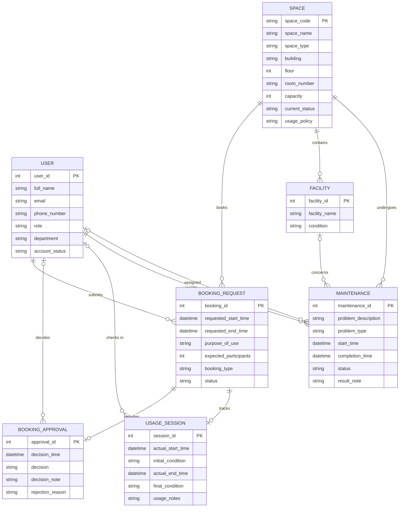

# Conceptual Design — ERD (Crow's Foot Notation) — Group G01

## 1. Entity-Relationship Diagram

---

## 2. Entity Descriptions and Attributes

### 2.1 User

Represents any person who interacts with the system (students, lecturers, TAs, facility staff, department administrators, facility manager).

| Attribute | Description | Type | Constraints |
|---|---|---|---|
| user_id | Unique system-generated identifier | Integer | PK |
| full_name | Full name of the user | String | Not null |
| email | University email address | String | Unique, not null |
| phone_number | Contact phone number | String | Optional |
| role | User's role in the system | String (enum) | Not null |
| department | Academic or administrative department | String | Not null |
| account_status | Whether the account is active, suspended, or inactive | String (enum) | Not null |

### 2.2 Space

A physical room or area that can be booked.

| Attribute | Description | Type | Constraints |
|---|---|---|---|
| space_code | Unique code for the space (e.g., CS-101) | String | PK |
| space_name | Human-readable name of the space | String | Not null |
| space_type | Category of the space | String (enum) | Not null |
| building | Building where the space is located | String | Not null |
| floor | Floor number within the building | Integer | Not null |
| room_number | Room number on that floor | String | Not null |
| capacity | Maximum number of people | Integer | Not null, > 0 |
| current_status | Operational status | String (enum) | Not null |
| usage_policy | Rules governing space use | Text | Optional |

### 2.3 Facility

A piece of equipment or amenity installed in a space (e.g., projector, whiteboard, microphone, computer, livestreaming equipment, air conditioner).

| Attribute | Description | Type | Constraints |
|---|---|---|---|
| facility_id | Unique identifier | Integer | PK |
| facility_name | Name of the facility | String | Not null |
| condition | Current working condition snapshot | String | Optional |

### 2.4 Booking Request

A request to use a space during a specific time period.

| Attribute | Description | Type | Constraints |
|---|---|---|---|
| booking_id | Unique identifier | Integer | PK |
| requested_start_time | Desired start date and time | DateTime | Not null |
| requested_end_time | Desired end date and time | DateTime | Not null |
| purpose_of_use | Description of the intended use | Text | Not null |
| expected_participants | Number of people expected | Integer | Not null, > 0 |
| booking_type | Category of the booking | String (enum) | Not null |
| status | Current state of the booking | String (enum) | Not null |

### 2.5 Booking Approval

Records the approval workflow details for a specific Booking Request.

| Attribute | Description | Type | Constraints |
|---|---|---|---|
| approval_id | Unique identifier | Integer | PK |
| decision_time | When the approval/rejection was made | DateTime | Not null |
| decision | The outcome of the review | String (enum) | Not null |
| decision_note | Notes accompanying the decision | Text | Optional |
| rejection_reason | Reason if rejected | Text | Optional |

### 2.6 Usage Session
Captures the actual physical usage of the space (check-in and check-out).

| Attribute | Description | Type | Constraints |
|---|---|---|---|
| session_id | Unique identifier | Integer | PK |
| actual_start_time | When the booking was checked in | DateTime | Not null |
| initial_condition | Space condition at check-in | Text | Not null |
| actual_end_time | When the booking was completed | DateTime | Optional |
| final_condition | Space condition at check-out | Text | Optional |
| usage_notes | Notes about the session | Text | Optional |

### 2.7 Maintenance

A record of maintenance work performed on a space.

| Attribute | Description | Type | Constraints |
|---|---|---|---|
| maintenance_id | Unique identifier | Integer | PK |
| problem_description | Description of the problem | Text | Not null |
| problem_type | Category of the problem | String (enum) | Not null |
| start_time | When maintenance began | DateTime | Optional |
| completion_time | When maintenance was completed | DateTime | Optional |
| status | Current state of the maintenance | String (enum) | Not null |
| result_note | Notes about the outcome | Text | Optional |

---

## 3. Relationships, Cardinalities, and Participation Constraints

| Relationship | Left Entity | Left Card. | Right Entity | Right Card. | Description |
|---|---|---|---|---|---|
| submits | USER | `\|\|` (exactly one) | BOOKING_REQUEST | `o{` (zero or more) | One user can submit many requests; a request must have exactly one requester. |
| decides | USER | `\|o` (zero or one) | BOOKING_APPROVAL | `o{` (zero or more) | A staff member creates many approval records; an approval is made by exactly one staff member. |
| checks in | USER | `\|o` (zero or one) | USAGE_SESSION | `o{` (zero or more) | A staff member checks in many sessions; a session is checked in by exactly one staff member. |
| reports | USER | `\|\|` (exactly one) | MAINTENANCE | `o{` (zero or more) | A user can report many maintenance issues; a maintenance record must have exactly one reporter. |
| assigned | USER | `\|o` (zero or one) | MAINTENANCE | `o{` (zero or more) | A staff member may be assigned many maintenance records; a maintenance record has at most one assignee. |
| books | SPACE | `\|\|` (exactly one) | BOOKING_REQUEST | `o{` (zero or more) | A space may receive many requests; a request is for exactly one space. |
| contains | SPACE | `\|\|` (exactly one) | FACILITY | `o{` (zero or more) | A space contains many facilities; a facility belongs to exactly one space. |
| undergoes | SPACE | `\|\|` (exactly one) | MAINTENANCE | `o{` (zero or more) | A space has many maintenance records; a maintenance record references exactly one space. |
| requires | BOOKING_REQUEST | `\|\|` (exactly one) | BOOKING_APPROVAL | `o\|` (zero or one) | A request may have one approval record; an approval maps to exactly one request. |
| tracks | BOOKING_REQUEST | `\|\|` (exactly one) | USAGE_SESSION | `o\|` (zero or one) | A checked-in request has one session; a session maps to exactly one request. |
| concerns | FACILITY | `\|o` (zero or one) | MAINTENANCE | `o{` (zero or more) | A specific facility might be tied to many maintenance records; a maintenance record might concern one specific facility item. |

### Crow's Foot Notation Legend

| Symbol | Meaning |
|---|---|
| `\|\|` | Exactly one (mandatory participation) |
| `\|o` | Zero or one (optional participation) |
| `}o` | Zero or more (optional many) |
| `}\|` | One or more (mandatory many) |

---

## 4. Participation Constraint Summary

| Relationship | Entity | Participation | Meaning |
|---|---|---|---|
| submits | USER | Mandatory | Every booking request has a non-null requester. |
| submits | BOOKING_REQUEST | Optional | A user may have zero booking requests. |
| decides | USER | Optional | Not every user creates approval records. |
| decides | BOOKING_APPROVAL | Mandatory | Every approval record must be made by exactly one staff member. |
| checks in | USER | Optional | Not every user performs check-ins. |
| checks in | USAGE_SESSION | Mandatory | Every usage session is checked in by exactly one staff member. |
| reports | USER | Mandatory | Every maintenance record has a reporter. |
| reports | MAINTENANCE | Optional | A user may have reported zero issues. |
| assigned | USER | Optional | Not every user is assigned maintenance tasks. |
| assigned | MAINTENANCE | Optional | Not every maintenance record has a staff assignee. |
| books | SPACE | Mandatory | Every booking request references exactly one space. |
| books | BOOKING_REQUEST | Optional | A space may have zero booking requests. |
| contains | SPACE | Mandatory | Every facility belongs to exactly one space. |
| contains | FACILITY | Optional | A space may have zero facilities. |
| undergoes | SPACE | Mandatory | Every maintenance record references exactly one space. |
| undergoes | MAINTENANCE | Optional | A space may have zero maintenance records. |
| requires | BOOKING_REQUEST | Mandatory | Every approval record maps to exactly one booking request. |
| requires | BOOKING_APPROVAL | Optional | Not every booking request has an approval record. |
| tracks | BOOKING_REQUEST | Mandatory | Every usage session maps to exactly one booking request. |
| tracks | USAGE_SESSION | Optional | Not every booking request has a usage session. |
| concerns | FACILITY | Optional | A maintenance record might concern a specific facility, but it is not required. |
| concerns | MAINTENANCE | Optional | A specific facility might be tied to zero maintenance records. |

---

## 5. Traceability Map

| Entity | Traced From |
|---|---|
| USER | Section 2 (Actors) + Section 3.1 (User attributes) + BR10 (Role-Based Actions) |
| SPACE | Section 3.2 (bookable shared spaces) + BR2 (Unique Space Identity) + DR1 (Maintenance Status Synchronization) |
| FACILITY | Section 3.3 (facilities) |
| BOOKING_REQUEST | Section 3.4 (Booking Request) + BR4 (Conflict Prevention) + BR6 (Booking Status Lifecycle) |
| BOOKING_APPROVAL | Section 3.5 (Booking Approval) + BR7 (Approval Recording) |
| USAGE_SESSION | Section 3.6 (Usage Session) + BR8 (Check-In/Check-Out Recording) |
| MAINTENANCE | Section 3.7 (Maintenance Record) + BR3 (Unavailable spaces cannot be booked) |